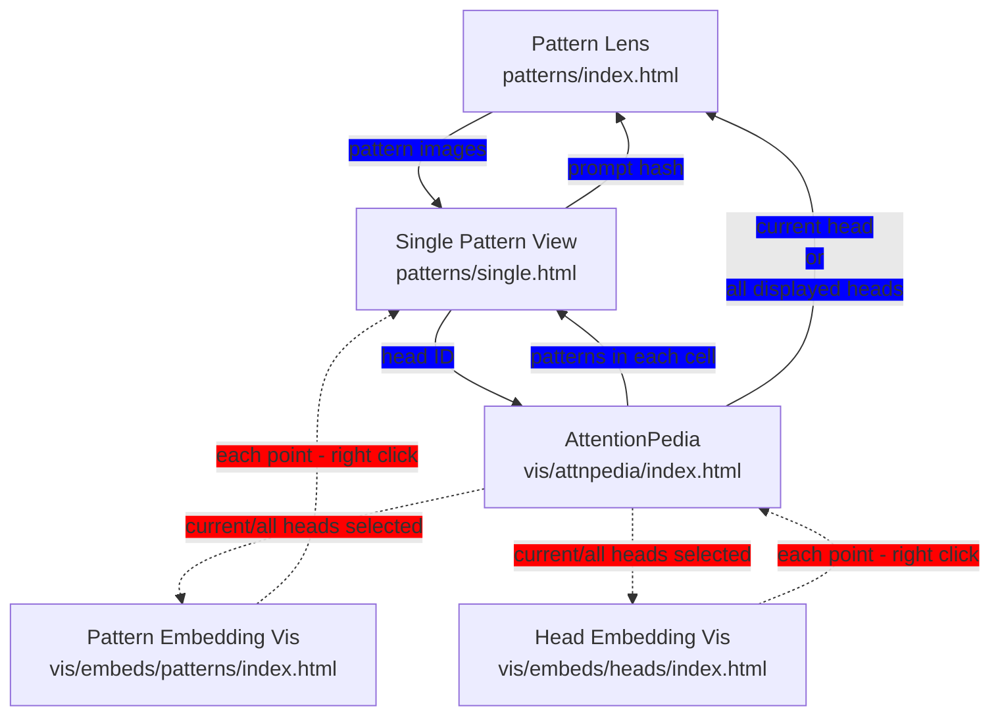

# Interface Relations and TODOs

> Note: we should attempt to make the needed connections with minimal changes to the code, instead working with the configuration files.

## Pattern Lens (`data/patterns/index.html`)

Allows comparing lots of patterns across many heads, models, etc. Uses tilde-separated URLs for compatibility and has model/head selection grids and prompt tables.

Outgoing connections:
- [x] **→ Single Pattern View** (pattern images): Click on pattern images to view detailed single pattern

## Single Pattern View (`data/patterns/single.html`)

Shows a single pattern and its prompt in detail with interactive heatmap and token highlighting.

Outgoing connections:
- [x] **→ Pattern Lens** (prompt hash): Click prompt hash to go to pattern lens with that prompt selected
- [x] **→ AttentionPedia** (head ID): Click head ID to go to attentionpedia for that head

## AttentionPedia (`data/vis/attnpedia/index.html`)

Shows a given head and then a selection of nearby/random/distant (in embedding space) heads, as well as heads with the same classification. These heads are the rows, columns are different prompts.

Outgoing connections:
- [x] **→ Single Pattern View** (patterns in each cell): Click on patterns in table cells to view detailed single pattern
- [x] **→ Pattern Lens** (current head or all displayed heads): Use links at top to go to pattern lens for current head or all displayed heads
- [ ] **→ Pattern Embedding Vis** (current/all heads selected): Add way to go to pattern embedding vis with current head/context selected
- [ ] **→ Head Embedding Vis** (current/all heads selected): Add way to go to head embedding vis with current head/context selected

## Pattern Embedding Vis (`data/vis/embeds/patterns/index.html`)

3D visualization of all attention patterns where each point represents a pattern.

Outgoing connections:
- [ ] **→ Single Pattern View** (each point - right click): Right-click on pattern points to go to single pattern view for that pattern

## Head Embedding Vis (`data/vis/embeds/heads/index.html`)

3D visualization where each point is a head in embedding space.

Outgoing connections:
- [ ] **→ AttentionPedia** (each point - right click): Right-click on head points to go to attentionpedia for that head

# interface relations diagram

- solid lines / blue label: existing connections
- dashed lines / red label: missing connections that should be added

